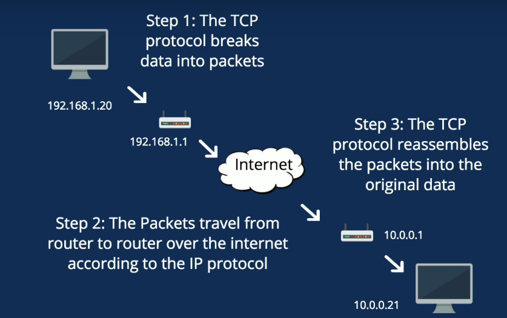

# Computer Networking

------

## The OSI Model

The Open Systems Interconnection Model (**OSI**) is a conceptual framework used to describe the functions of a networking **system**. The [International Standards Organization (ISO)](https://www.webopedia.com/TERM/I/ISO.html) developed the Open Systems Interconnection (OSI) model. It divides network communication into seven layers. In this model,  layers 1-4 are considered the lower layers, and mostly concern  themselves with moving data around. Layers 5-7, called the the upper  layers, contain application-level data. Each layer takes care of a very specific job, and then passes the data onto the next layer.

​												*Fig: The 7 Layers of OSI Model (Credit: [REALITYPOD.COM](https://realitypod.com))*

### Application (Layer 7)

OSI Model, Layer 7, supports [application](https://www.webopedia.com/TERM/A/application.html) and end-user processes. Communication partners are identified, quality  of service is identified, user authentication and privacy are  considered, and any constraints on data [syntax](https://www.webopedia.com/TERM/S/syntax.html) are identified. Everything at this layer is application-specific. This layer provides application services for file transfers, [e-mail](https://www.webopedia.com/TERM/E/e_mail.html), and other [network](https://www.webopedia.com/TERM/N/network.html) [software](https://www.webopedia.com/TERM/S/software.html) services. [Telnet](https://www.webopedia.com/TERM/T/Telnet.html) and [FTP](https://www.webopedia.com/TERM/F/ftp.html) are applications that exist entirely in the application level. Tiered application architectures are part of this layer.

* Layer 7 Application examples include WWW browsers, NFS, SNMP, Telnet, HTTP, FTP, DNS 

### Presentation (Layer 6)

This layer provides independence from differences in data representation (e.g., [encryption](https://www.webopedia.com/TERM/E/encryption.html)) by translating from application to network format, and vice versa. The  presentation layer works to transform data into the form that the  application layer can accept. This layer formats and encrypts data to be sent across a [network](https://www.webopedia.com/TERM/N/network.html), providing freedom from compatibility problems. It is sometimes called the syntax layer.

* Layer 6 Presentation examples include SSL, TLS, encryption, ASCII, EBCDIC, TIFF, GIF, PICT, JPEG, MPEG, MIDI.*

### Session (Layer 5)

This layer establishes, manages and terminates connections between [applications](https://www.webopedia.com/TERM/A/application.html). The session layer sets up, coordinates, and terminates conversations,  exchanges, and dialogues between the applications at each end. It deals  with session and connection coordination.

* Layer 5 Session examples include NFS, NetBios names, PPTP, RPC, SQL.*

### Transport (Layer 4)

OSI Model, Layer 4, provides transparent transfer of data between end systems, or [hosts](https://www.webopedia.com/TERM/H/host.html), and is responsible for end-to-end error recovery and [flow control](https://www.webopedia.com/TERM/F/flow_control.html). It ensures complete data transfer.

* Layer 4 Transport examples include SPX, TCP, UDP.*

### Network (Layer 3)

Layer 3 provides [switching](https://www.webopedia.com/TERM/P/packet_switching.html) and [routing](https://www.webopedia.com/TERM/R/routing.html) technologies, creating logical paths, known as [virtual circuits](https://www.webopedia.com/TERM/V/virtual_circuit.html), for transmitting data from [node](https://www.webopedia.com/TERM/N/node.html) to node. Routing and forwarding are functions of this layer, as well as [addressing](https://www.webopedia.com/DidYouKnow/Internet/IPaddressing.asp), [internetworking](https://www.webopedia.com/TERM/I/internetworking.html), error handling, [congestion](https://www.webopedia.com/TERM/C/congestion.html) control and packet sequencing.

* Layer 3 Network examples include AppleTalk DDP, IP, ARP, ICMP, IPSec IPX.*

### Data Link (Layer 2)

At OSI Model, Layer 2, data packets are [encoded](https://www.webopedia.com/TERM/E/encoding.html) and decoded into bits. It furnishes [transmission protocol](https://www.webopedia.com/TERM/T/TCP_IP.html) knowledge and management and handles errors in the physical layer, flow control and frame synchronization. The data link layer is divided into  two sub layers: The Media Access Control ([MAC](https://www.webopedia.com/TERM/M/MAC_address.html)) layer and the [Logical Link Control](https://www.webopedia.com/TERM/L/Logical_Link_Control_layer.html) (LLC) layer. The MAC sub layer controls how a computer on the network  gains access to the data and permission to transmit it. The LLC layer  controls frame [synchronization](https://www.webopedia.com/TERM/D/data_synchronization.html), flow control and error checking.

* *Layer 2 Data Link examples include PPP, FDDI, ATM, Ethernet , IEEE 802.5/ 802.2, IEEE 802.3/802.2, HDLC, Frame Relay.* 

### Physical (Layer 1)

OSI Model, Layer 1 conveys the bit stream - electrical impulse, light or radio signal — through the [network](https://www.webopedia.com/TERM/N/network.html) at the electrical and mechanical level. It provides the [hardware](https://www.webopedia.com/TERM/H/hardware.html) means of sending and receiving data on a carrier, including defining cables, cards and physical aspects. [Fast Ethernet](https://www.webopedia.com/TERM/1/100Base_T.html), [RS232](https://www.webopedia.com/TERM/R/RS_232C.html), and [ATM](https://www.webopedia.com/TERM/A/ATM.html) are [protocols](https://www.webopedia.com/TERM/P/protocol.html) with physical layer components.

* *Layer 1 Physical examples include Ethernet, USB, Bluetooth, IEEE802.11 FDDI, B8ZS, V.35, V.24, RJ45.*

## TCP-IP

### What is "TCP-IP" ?

#### **TCP (Transmission Control Protocol)**

is a standard that defines how to establish and maintain a network conversation via which application programs can exchange data.

#### **Virtual Port**

Ports allow software applications to share hardware resources without interfering with each other. In IP networking these ports are numbered 0 through 65535.

#### **IP (Internet Protocol)**

The Internet Protocol is responsible for addressing hosts and for routing datagrams(packets) from a source host to a destination host across one or more IP networks. 

##### **Versions:**

##### **IPv4**: IPv4 (***I**nternet **P**rotocol **V**ersion **4***) is the fourth revision of the Internet Protocol (IP) used to to  identify devices on a network through an addressing system. The Internet Protocol is designed for use in interconnected systems of  packet-switched computer communication networks.

IPv4 is the most widely deployed Internet protocol used to connect  devices to the Internet. IPv4 uses a 32-bit address scheme allowing for a total of 2^32 addresses (just over 4 billion addresses). With the  growth of the Internet it is expected that the number of unused IPv4  addresses will eventually run out because every device -- including  computers, smartphones and game consoles -- that connects to the  Internet requires an address.

##### **IPv6**: A new Internet addressing system Internet Protocol version 6 (IPv6)  is being deployed to fulfill the need for more Internet addresses.

IPv6 (***I**nternet **P**rotocol **V**ersion **6***) is also called IPng (***I**nternet **P**rotocol **n**ext **g**eneration*) and it is the newest version of the Internet Protocol (IP) reviewed in the [IETF](https://www.webopedia.com/TERM/I/IETF.html) standards committees to replace the current version of IPv4 (Internet Protocol Version 4). 

 IPv6 is the successor to Internet Protocol Version 4 (IPv4). It was  designed as an evolutionary upgrade to the Internet Protocol and will,  in fact, coexist with the older IPv4 for some time. IPv6 is designed to  allow the Internet to grow steadily, both in terms of the number of  hosts connected and the total amount of data traffic transmitted.

IPv6 is often referred to as the "next generation" Internet standard  and has been under development now since the mid-1990s. IPv6 was born  out of concern that the demand for IP addresses would exceed the  available supply.

#####  **The Benefits of IPv6**

While increasing the pool of addresses is one of the most  often-talked about benefit of IPv6, there are other important  technological changes in IPv6 that will improve the IP protocol:

- No more NAT (Network Address Translation)
- Auto-configuration
- No more private address collisions
- Better multicast routing
- Simpler header format
- Simplified, more efficient routing
- True quality of service (QoS), also called "flow labeling"
- Built-in authentication and privacy support
- Flexible options and extensions
- Easier administration (say good-bye to DHCP)

**The Difference Between IPv4 and IPv6 Addresses**

An [IP address](https://www.webopedia.com/TERM/I/IP_address.html) is [binary](https://www.webopedia.com/TERM/B/binary.html) numbers but can be stored as text for human readers. For example, a  32-bit numeric address (IPv4) is written in decimal as four numbers  separated by periods. Each number can be zero to 255. For example, **1.160.10.240** could be an IP address.

IPv6 addresses are 128-bit IP address written in hexadecimal and  separated by colons. An example IPv6 address could be written like this:  **3ffe:1900:4545:3:200:f8ff:fe21:67cf**.

**Did You Know...?** *IPv6 in the News: (April, 2017) MIT announced it would sell half of its 16  million valuable IPv4 addresses and use the proceeds of the sale to  finance its own IPv6 network upgrades.*

| **Basis for differences**          | **IPv4**                                                     | **IPv6**                                                     |
| ---------------------------------- | ------------------------------------------------------------ | ------------------------------------------------------------ |
| Size of IP address                 | IPv4 is a 32-Bit IP Address.                                 | IPv6 is 128 Bit IP Address.                                  |
| Addressing method                  | IPv4 is a numeric address, and its binary bits are separated by a dot (.) | IPv6 is an alphanumeric address whose binary bits are separated by a colon (:). It also contains hexadecimal. |
| Number of header fields            | 12                                                           | 8                                                            |
| Length of header filed             | 20                                                           | 40                                                           |
| Checksum                           | Has checksum fields                                          | Does not have checksum fields                                |
| Example                            | 12.244.233.165                                               | 2001:0db8:0000:0000:0000:ff00:0042:7879                      |
| Type of Addresses                  | Unicast, broadcast, and multicast.                           | Unicast, multicast, and anycast.                             |
| Number of classes                  | IPv4 offers five different classes of IP Address. Class A to E. | lPv6 allows storing an unlimited number of IP Address.       |
| Configuration                      | You have to configure a newly installed system before it can communicate with other systems. | In IPv6, the configuration is optional, depending upon on functions needed. |
| VLSM support                       | IPv4 support VLSM (Virtual Length Subnet Mask).              | IPv6 does not offer support for VLSM.                        |
| Fragmentation                      | Fragmentation is done by sending and forwarding routes.      | Fragmentation is done by the sender.                         |
| Routing Information Protocol (RIP) | RIP is a routing protocol supported by the routed daemon.    | RIP does not support IPv6. It uses static routes.            |
| Network Configuration              | Networks need to be configured either manually or with DHCP. IPv4 had several  overlays to handle Internet growth, which require more maintenance  efforts. | IPv6 support autoconfiguration capabilities.                 |
| Best feature                       | Widespread use of NAT (Network address translation) devices which allows single  NAT address can mask thousands of non-routable addresses, making  end-to-end integrity achievable. | It allows direct addressing because of vast address Space.   |
| Address Mask                       | Use for the designated network from host portion.            | Not used.                                                    |
| SNMP                               | SNMP is a protocol used for system management.               | SNMP does not support IPv6.                                  |
| Mobility & Interoperability        | Relatively constrained network topologies to which move restrict mobility and interoperability capabilities. | IPv6 provides interoperability and mobility capabilities which are embedded in network devices. |
| Security                           | Security is dependent on applications - IPv4 was not designed with security in mind. | IPSec(Internet Protocol Security) is built into the IPv6 protocol, usable with a proper key infrastructure. |
| Packet size                        | Packet size 576 bytes required, fragmentation optional       | 1208 bytes required without fragmentation                    |
| Packet fragmentation               | Allows from routers and sending host                         | Sending hosts only                                           |
| Packet header                      | Does not identify packet flow for QoS handling which includes checksum options. | Packet head contains Flow Label field that specifies packet flow for QoS handling |
| DNS records                        | Address (A) records, maps hostnames                          | Address (AAAA) records, maps hostnames                       |
| Address configuration              | Manual or via DHCP                                           | Stateless address autoconfiguration using Internet Control Message Protocol version 6 (ICMPv6) or DHCPv6 |
| IP to MAC resolution               | Broadcast ARP                                                | Multicast Neighbour Solicitation                             |
| Local subnet Group management      | Internet Group Management Protocol GMP)                      | Multicast Listener Discovery (MLD)                           |
| Optional Fields                    | Has Optional Fields                                          | Does not have optional fields. But Extension headers are available. |
| IPSec                              | Internet Protocol Security (IPSec) concerning network security is optional | Internet Protocol Security (IPSec) Concerning network security is mandatory |
| Dynamic host configuration Server  | Clients have approach DHCS (Dynamic Host Configuration server) whenever they want to connect to a network. | A Client does not have to approach any such server as they are given permanent addresses. |
| Mapping                            | Uses ARP(Address Resolution Protocol) to map to MAC address  | Uses NDP(Neighbour Discovery Protocol) to map to MAC address |
| Combability with mobile devices    | IPv4 address uses the dot-decimal notation. That's why it is not suitable for mobile networks. | IPv6 address is represented in hexadecimal, colon- separated notation. IPv6 is better suited to mobile networks. |

IPv4 and IPv6 cannot communicate with other but can exist together on the same network. This is known as **Dual Stack.** 

#### **TCP SOCKET**

A socket is one endpoint of a two way communication link between two programs running on the network. A socket is bound to a port number so that the TCP layer can Identify the application that data is destined to be sent to.

​						Fig: Understanding of sockets concept. (Photo: [ibm.com](https://www.ibm.com/))

### How does TCP-IP work?

​	Fig: How TCP/IP Works (Photo: [fullstackacademy.com](https://www.fullstackacademy.com) )

## What is DHCP (Dynamic Host Configuration Protocol)? 

DHCP (Dynamic Host Configuration Protocol) is a protocol that provides  quick, automatic, and central management for the distribution of [IP addresses](https://www.lifewire.com/what-is-an-ip-address-2625920) within a network. DHCP is also used to configure the [subnet mask](https://www.lifewire.com/internet-protocol-tutorial-subnets-818378), default gateway, and [DNS server](https://www.lifewire.com/what-is-a-dns-server-2625854) information on the device.

### How does DHCP work?

- Assigns IP addresses to hosts

- Comes as a client and as a server

- Step By Step:

  - DHCPDiscover - Look for a DHCP server 
  - DHCPOffer - The DHCP server offers an address
  - DHCPRequest - The host requsts to lease the address 
  - DHCPACK (Acknowledgement) - DHCP server sends the IP addresses to the host

  **UDP Port** 

  Client: 68 

  Server: 67

​     Fig: How does DHCP work? (Photo: [ubalt.edu](http://home.ubalt.edu/abento/454/2knetwork/img012.gif))

### Pros and Cons of Using DHCP  

A computer, or any device that connects to a network (local or  internet), must be properly configured to communicate on that network.  Since DHCP allows that configuration to happen automatically, it's used  in almost every device that connects to a network including computers, [switches](https://www.lifewire.com/definition-of-network-switch-817588), smartphones, and gaming consoles.

Because of this [dynamic IP address](https://www.lifewire.com/what-is-a-dynamic-ip-address-2625857) assignment, there's less chance that two devices will have the [same IP address](https://www.lifewire.com/what-is-ip-address-conflict-818381), which is common when using manually-assigned, [static IP addresses](https://www.lifewire.com/what-is-a-static-ip-address-2626012).

Using DHCP makes a network easier to manage. From an administrative  point of view, every device on the network can get an IP address with  nothing more than their default network settings, which is set up to  obtain an address automatically. The alternative is to manually assign  addresses to each device on the network.

Because these devices can get an IP address automatically, devices can  move freely from one network to another (given that each device is set  up with DHCP) and receive an IP address automatically, which is helpful  with mobile devices.

In most cases, when a device has an IP address assigned by a DHCP  server, that IP address changes each time the device joins the network.  If IP addresses are assigned manually, administrators must give out a  specific address to each new client, and existing addresses that are  assigned must be manually unassigned before other devices can use that  address. This is time-consuming, and manually configuring each device  increases the chance of errors.

There are advantages to using DHCP, and there are disadvantages.  Dynamic, changing IP addresses should not be used for devices that are  stationary and need constant access, like printers and file servers.  Although these types of devices exist predominantly in office  environments, it's impractical to assign them with a changing IP  address. For example, if a network printer has an IP address that will  change at some point in the future, every computer that's connected to  that printer will have to regularly update their settings to understand  how to contact the printer.

This type of setup is unnecessary and can be avoided by not using DHCP  for those types of devices, and instead by assigning a static IP address to them.

The same idea comes into play if you need permanent remote access to a  computer in a home network. If DHCP is enabled, that computer will get a new IP address at some point, which means the one you recorded for that computer will not be accurate for long. If you use [remote access software](https://www.lifewire.com/free-remote-access-software-tools-2625161) that relies on an IP address-based access, use a static IP address for that device.

[Take Control of Your Windows Networking and Disable DHCP   ](https://www.lifewire.com/disable-dhcp-5075607)

### More Information On DHCP  

A DHCP server defines a scope, or range, of IP addresses that it uses to serve devices with an address. This pool of addresses is the only way a device obtains a valid network connection.

This is another reason DHCP is so useful. DHCP allows several devices to connect to a network over a period of time without needing a pool of  available addresses. For example, if 20 addresses are defined by the  DHCP server, 30, 50, 200, or more devices can connect to the network as  long as no more than 20 devices use one of the available IP addresses  simultaneously.

Because DHCP assigns IP addresses for a specific period of time (called a lease period), using [commands](https://www.lifewire.com/what-is-a-command-2625828) like ipconfig to find a computer's IP address yields different results over time.

Though DHCP is used to deliver dynamic IP addresses to its clients, it  doesn't mean static IP addresses can't also be used at the same time. A  mixture of devices that get dynamic addresses and devices that have  their IP addresses manually assigned to them, can both exist on the same network.

[ISPs](https://www.lifewire.com/internet-service-provider-isp-2625924) use DHCP to assign IP addresses. This can be seen when identifying your [public IP address](https://www.lifewire.com/what-is-a-public-ip-address-2625974). It will likely change over time unless your home network has a static  IP address, which is usually only the case for businesses that have  publicly accessible web services.

In Windows, [APIPA](https://www.lifewire.com/automatic-private-internet-protocol-addressing-816437) assigns a special temporary IP address when the DHCP server fails to  deliver a functional one to a device and uses this address until it  obtains one that works.

### What is interface and loopback interface?

 		 			 	.jpg) 	 		[Richard Burts](https://community.cisco.com/t5/user/viewprofilepage/user-id/326229) 	 	 	 	 	 	 	 	  		 	 		  	

​			Hall of Fame Guru 	

A loopback interface is a virtual  interface that can be configured on a router. When we say it is a  virtual interface this means that it logically exists but it does not  exist physically (there is no physical interface and no cable to plug  into it). One important aspect of the loopback interface is that it  removes physical dependencies - you can not unplug a cable and have the  interface go down (unless the cable was the power cable for the router).

The loopback interface can have many uses. Some routing protocols have the  concept of a routerID and we frequently want a loopback interface  address to be the RID (because it is more stable than any physical  interface). We frequently want to use a loopback interface addresses for management purposes. We may want to source our SNMP messages from the  loopback. If we want to ping an interface on the router to determine  whether the router is up or not it is good to ping the loopback  interface. If you want to telnet to the router you do not have to be  concerned whether you are accessing it by its serial interface, its  Ethernet interface, or any other interface if you telnet to the loopback interface address. If you are using AAA and an ACS server for  authentication it is good to source the authentication packets using the loopback interface. Some protocols need to specify peer addresses (BGP, and GRE tunnels and IPSec are examples that come to mind) and it may be advantageous to use the loopback interface address as the peer address.

There are more uses for loopback interfaces but this gets the discussion started.

HTH

Rick

HTH

Rick

## **What Is Latency?**  

https://sematext.com/blog/what-is-latency/

Latency is the time it takes for a request to travel from the sender to the receiver and for the receiver to  process that request. In other words, it’s the time it takes for the  request sent from the browser to be processed and returned by the  server.

Consider a simple e-commerce store that  caters to users worldwide. High latency will make browsing categories  and products very difficult and in a space as competitive as online  retailing, the few extra seconds can amount a fortune in lost sales.

## **How Network Latency Affects Website Performance**

There are no two ways about it. Your app  will react differently based on your user’s location and it has to do  with something we call server latency.

The experience of your customers living in a different part of the world will be vastly different from what you  are seeing in your tests. It’s crucial to gather data from every  location that your users live in, that way you can take the necessary  steps to fix the issue.

### What Is a Good Latency?

While there’s no clear number for good latency because every case is unique  in its own way, as a guideline, your website should try to completely  load under 3 seconds. That means images, scripts, dynamic elements,  everything needs to load in under 3 seconds.

There’s going to be some delay created by the client itself as the browser  needs time to process the requests and render the response. So while 3  seconds might sound enough to load a few kb of data, the truth is that  you should be very mindful about the size and complexity of your code  and requests as they will take a while to load and render.

### Why Should You Measure Network Latency?

Providing an overall good service across the world is not just good for your image, it’s good for your  business. You’ll soon come to realize that bad user experience will  affect your bottom line directly.

To use the eCommerce example again here is a little quote from [Yoast](http://www.yoast.com/) that will put things into perspective: ***79% of online shoppers say they won’t go back to a website if they’ve had trouble with load speed**.*

And let’s not forget that fast-loading sites have higher [conversion rates](https://sematext.com/blog/ux-metrics/#toc-conversion-rate-11) and lower bounce rates. So it’s not a matter of whether you should or  shouldn’t invest in optimizing your load speed across multiple regions,  but rather if you can afford not to.

# CIDR: what is classless inter-domain routing?

The internet is huge, but even in this vast global network, there’s a lack  of space. The system of IP addresses as we are currently using it  (IPv4), has been long exhausted. All possible addresses (at least  4,294,967,296) have already been assigned. A solution had to be thought  up a few decades ago to solve the problem. CIDR helps **extend the amount of available addresses**.

What was intended as a temporary solution has now been active for over 20 years. And since the widespread introduction of [IPv6](https://www.ionos.com/digitalguide/server/know-how/what-are-the-benefits-of-ipv6/) is still a long time coming, CIDR will probably still be around for years to come. This is reason enough to learn more about **class inter-domain routing**.

**Contents**

1. [Why was CIDR developed?](https://www.ionos.com/digitalguide/server/know-how/cidr-classless-inter-domain-routing/#c135946)
2. [How does CIDR work?](https://www.ionos.com/digitalguide/server/know-how/cidr-classless-inter-domain-routing/#c135949)
3. [The CIDR notation](https://www.ionos.com/digitalguide/server/know-how/cidr-classless-inter-domain-routing/#c135951)
4. [CIDR blocks: explanation and table](https://www.ionos.com/digitalguide/server/know-how/cidr-classless-inter-domain-routing/#c135953)
5. [Calculating CIDR: examples](https://www.ionos.com/digitalguide/server/know-how/cidr-classless-inter-domain-routing/#c135955)

## Why was CIDR developed?

As early on as 1993, it was clear that the internet was growing quicker  than had initially been anticipated. So, a solution was needed, which **meant abandoning the network classes**. The IP addresses were originally divided into five classes. If a  company wanted to be connected to the internet, it had to choose an IP  address from the appropriate class. For each class, different numbers of octets (the four numerical blocks of IP addresses) were used to  identify the networks. The remaining octets determined the number of  hosts in a network.

|          Class A          |           Class B           |           Class C           |           Class D           |           Class E           |
| :-----------------------: | :-------------------------: | :-------------------------: | :-------------------------: | :-------------------------: |
| 0.0.0.0 - 127.255.255.255 | 128.0.0.0 - 191.255.255.255 | 192.0.0.0 - 223.255.255.255 | 224.0.0.0 - 239.255.255.255 | 240.0.0.0 - 255.255.255.255 |

For example, a class A network could accommodate over 16 million hosts, but only 128 (0-127) of these networks were available. In class B, on the  other hand, slightly more than 16,000 networks were possible, but each  network could contain 65,534 hosts. The networks in class C only had an  octet left and could only accommodate 254 (1-254, since 0 and 255 are  always reserved) hosts.

This shows that the classification just  wasn’t practical in most cases. For many companies, a network with only  254 participants was far too small, but several thousands of hosts need  the fewest networks. This ultimately led to a lot of waste, since  companies inevitably had to collect unused addresses. To meet the **needs of internet users** better, it was decided to make the network sizes more flexible, to reduce the  size of routing tables in internet routers, and to slow down the  decrease in the number of available IP addresses.

**Routing tables** are located in a router and help find the way to the correct  destination address. Data packets pass through many nodes from origin to destination. For routers to recognize what the optimal path through the network looks like, a corresponding table is fed with information. The  size of the file grows exponentially when a path has to be introduced  for every possible target. Since CIDR assembles addresses into blocks,  it is no longer necessary to store so much information in the routing  tables. This means that several addresses are combined into one route.

## How does CIDR work?

CIDR is based on the idea of [subnet masks](https://www.ionos.com/digitalguide/server/know-how/subnetting-how-do-subnets-work/). A mask is placed over an IP address and creates a sub network: a network that is subordinate to the internet. The **subnet mask** signals to the router which part of the IP address is assigned to the  hosts (the individual participants of the network) and which determines  the network.

Instead of adding a subnet mask, a specification **in the form of suffixes can also be integrated directly into the IP address** using classless inter-domain routing. But this not only shortens the  display: CIDR also makes it possible to create supernets in addition to  subnets. This means that it is not only possible to subdivide a network  more precisely, but also to combine several networks.

Supernets  are important, for example, if a company has several locations but wants to deal with all computers in the same network. Supernets allow several networks to be combined into one route, which is why this technology is also called **route aggregation** (i.e. grouping of  routes). This means that data packets are only sent to one destination – regardless of where the hosts are located.

 Fact

**VLSM** is an important part of CIDR: the **variable length subnet mask** allows subnets to be realized with variable lengths and not only in size order of the network classes.

## The CIDR notation

An IP address made it possible in the past to determine which class it  belonged to. For example, the class C networks were located between the  addresses 192.0.0.0 and 223.255.255.255. A subnet mask (e.g.  255.255.255.0) **is like a mask on top of the IP address**  and specifies the hosts. In CIDR format, this information is stored as a suffix in the IP address itself. However, the basic principle remains  the same: the suffix specifies which places (bits) of the IP address  represent the network ID and therefore which bits automatically make up  the range of the host ID. If you want to understand this in detail, it  makes sense to look at a subnet mask in its binary form:

255.255.255.0 ≙ 11111111 11111111 11111111 00000000

In CIDR notation, this (class C) subnet mask would be /24, since the first 24 bits determine the network component of the IP address. It’s  possible to not only to fill octets completely with ones or zeros, but  also to create more **flexible subnets** using VLSM. For  example, the mask /25 corresponds to the binary value 11111111 11111111  11111111 10000000, which in turn (in dot-decimal notation) corresponds  to 255.255.255.128.

 Note

Even with CIDR and VLSM, bits in subnet masks must always be filled from left to right and must not be randomly set to 1 or 0.

## CIDR blocks: explanation and table

An IPv4 address consists of 32 bits. This becomes clear when you convert the decimal notation into **the binary equivalent**: 201.105.7.34 corresponds to 11001001 01101001 00000111 00100010. The  binary notation – and the calculation method with which computers  operate – of an IP address consists of 32 digits, which can either be 1  or 0: hence 32 bits. So, the possible suffixes in CIDR notation range  from 0 to 32.

Creating subnets is about **creating commonalities**. 201.105.7.34/24 is in the same network as 201.105.7.1/24. The suffix  signals that only the first 24 bits of the network component are  counted. To do this, they have to be the same, if both addresses are to  belong to the same network. The remaining bits are reserved for the host part. The number of bits that you see right after the slash in CIDR  format indicates the number of digits (from left to right) that belong  to the power supply of the IP address. The following table shows which  subnet masks are behind the CIDR notation and how many host addresses  they allow.

However, not all networks can also provide hosts. Networks with /31 have only 2  possible IP addresses for hosts, which would then have to be used for  the network address (only 0s in the host part) and the broadcast address (only 1s in the host part). Two addresses are always reserved in each  network: the network address (only 0s in the host part), which serves to identify the network, and the broadcast address (only 1s in the host  part), which is used for transmission to all network participants. So,  not all networks have the possibility to provide hosts. A /31 network  has only 2 possible IP addresses, which must then be used for broadcast  and network addresses. When looking at the CIDR table, then, **two addresses must always be subtracted from the total available addresses**. In the /32 network, however, only one address is available, and does not allow either broadcast nor network addresses.

The /0 network includes the complete address space. This contains only **a large network with all possible IP addresses** (minus two) as hosts so this doesn’t really count as a subnet. The nets /1 to /7 are also not used for individual subnets. Since the possible  number of hosts is too large, these networks are divided into further  subnets.

## Calculating CIDR: examples

The principle behind CIDR can be explained more clearly using examples. In  the following, we will explain how it works in both subnetting as well  as supernetting.

### Subnetting

If you want to create subnets (especially flexible subnets), it is **not enough to simply attach the same suffix to the IP address**. It is important to understand what happens with binary conversion.  192.168.200.5/30 and 192.168.200.9/30 do not belong to the same network, for example. The reason for this can be seen when both addresses and  the corresponding subnet mask are represented as binary numbers. A  logical connective is then required. To do this, the two values are  compared, which will only be transferred to the network address if there is a 1 at the same position. The combinations 0 ∧ 0 and 0 ∧ 1 result in zero.

Both addresses are therefore not in the same network. They would have been,  however, if the second address had been 192.168.200.6/30.

To  calculate which IP addresses are available to you in a subnet, you have  to calculate the area. For example, a company has to accommodate 2.000  hosts in a network. The **CIDR table** tells us that we need a /21 network. Alternatively, this can also be calculated. To do this, you must create a logarithm: x=log2(2000). The result (≈10,666) is not a natural number, so you can round it up: 11. You can form a subnet with 211 hosts: 2,048 (two addresses for broadcast and network address need to be subtracted).

If you look at the table, you will see that the powers of 2 rise from  (/32) to (/0). So, you could calculate 32-11 = 21 to get the required  subnet suffix (/21).

The number assigned by this internet provider is (in our example) 210.105.44.170. We also transfer this information  into binary notation and use the mask that has just been determined.

The first address – the network address that shouldn’t be used – is  210.105.40.0/21. You have 2,046 IP addresses available between this and  the broadcast address. The highest IP address (broadcast) is  210.105.47.255/21. Why is that? 2,048 (the maximum number of addresses  in the subnet) divided by 256 (the number of possibilities in one octet) results in 8. This means that in the third octet the eight values from  40 to 47, and in the fourth octet, all values from 0 to 255, must be  covered.

 Tip

You can also save yourself the arithmetic work: there are some good online  computers that will give you the area for your host addresses. In most  cases, however, you still have to determine the required subnet size  yourself. But you can find it in the corresponding table.

### Supernetting

Let’s assume that a company has three sites and three networks and their  corresponding routers. It would make sense – also in the **sense of the routing table** – to turn it into a supernet. The three networks have the addresses  192.168.43.0, 192.168.44.0, and 192.168.45.0 (possible subnet masks next to the IP addresses of the networks are first relevant in this  context). We first compare them in binary notation and only use the  digits that all three addresses have in common – from left to right:  From the first difference, all other digits are set to zero.

The network address of the supernet is therefore 192.168.40.0. To determine the corresponding subnet mask that belongs to this network, you count  the places (bits) that led to the new IP address. In our example, these  are 21 bits: 192.168.40.0/21.